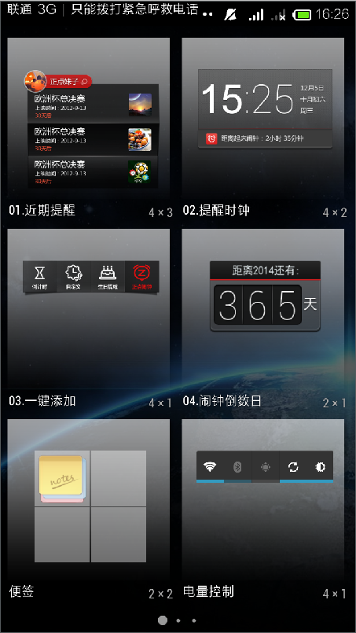

# Android 4.4 桌面源代码

本桌面项目的代码是直接从Android4.4代码中单独抽离出来的，虽然项目依赖的库文件不多，但是这里
有一个比较大的坑：1. `BackupProtos` 该类在整个项目中找不到，需要我们去google或者是百度上自
己去找，不知道为啥当初他们是如何编译整个android源代码的，2. 在网上找到的这个类用在我们的项目
中的是，然后再引入google protobuf的时候发现系统源代码中的那个类与`BackupProtos`对应不上的，
所以这个时候又只能去网上找其jar包了，这个两个问题是比较麻烦的。虽然我已经找到了protobuf jar,
但是没有去找他的源代码了，所以这里需要对本项目进行二次开发的童鞋自己去找其代码了，可以看看里面
的一些原理。在编译本项目的时候最好按照我的那个build配置，别提高编译的版本，否则可能会出现有些
图片和文件编译有问题的。launcher.apk 是我编译和运行都成功的apk，对于没有编译成功的童鞋可以直接
拿来运行看看其效果，最后还是附上其最后的效果图：

